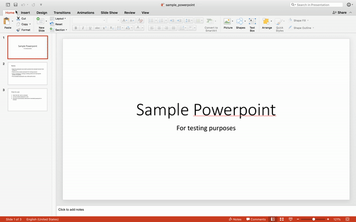

# Baidu's Machine Translation API #

### Getting Started with Translate PPTX: ### 

Simple combinations of Baidu’s API’s and freeware can be very powerful. In the case of Baidu's Machine Translation API, you can translate any powerpoint between these [28 languages](https://github.com/albertzhang24/documentation/blob/master/Desktop/documentation_img/REFERENCES.md). Just choose a source to target language option and a powerpoint, and we will take care of the rest!
****************************************************************************************************
### Walkthrough: ###

****************************************************************************************************
### An Easy Example ###

Open your terminal, and run **python helloworld_translation.py** to translate "Hello World"!

****************************************************************************************************
### How it Works: ###

* Text Extraction  
    * Using the python-pptx library, the python script searches each slide of a powerpoint for all of its paragraph text runs. 
* Translation process
    * The scipt's _translate function translates the powerpoint's text content by sending a GET request to Baidu's free Univeral Translation API for each text run.  
* Putting it on a Server
    * With [serverless](https://github.com/albertzhang24/documentation/blob/master/serverless_README.md) as the framework and AWS as the cloud provider, we were able to put this service on a server. 

****************************************************************************************************
### Setup for Access ID and Secret Key: ###

* Log in to your Baidu account.
* Open http://fanyi-api.baidu.com/api/trans/product/index and click on the bottom “use immediately” button. 
* Fill in the required fields to register as a developer.

* To apply for API Access, click on the “overview” option in the leftmost menu, and then the “open now” button under the “My Service” section.
* Select the Universal Translation API option and fill in the required fields. 
    * Under “website/application”, fill in a description of the goal you want to achieve using this API. You can leave the IP address section blank, but it is recommended that you fill it in for security reasons. 

* Once you have finished appyling, you will see the Access ID and Secret Key in your newly created application box. 

****************************************************************************************************

### FAQ: ###
**Q:** Does this work for ppt files, Microsoft Office documents, web pages and other?

**A:** No, so far this only works for pptx files. However, you can use https://fanyi.baidu.com/?sid=607 for document translation. We are currently working on supporting translation for other file types as well. 

**Q:** Can I set up my own source to target language options?

**A:** Yes, modify our source code and create your own options in the form field of index.html under templates. 

**Q:** Does this work for translating text in pictures?

**A:** Not currently, but getting OCR to work for powerpoint images is next up on our to-do list.
****************************************************************************************************
### Reference Sources: ###
[Language List](https://github.com/albertzhang24/documentation/blob/master/language_list.md)

[Error Codes List](https://github.com/albertzhang24/documentation/blob/master/error_codes.md)

****************************************************************************************************
### Feedback ###

Please make an issue, and we'll get back to you as soon as possible. 
